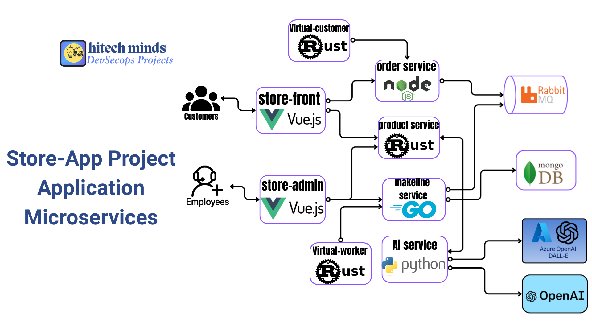
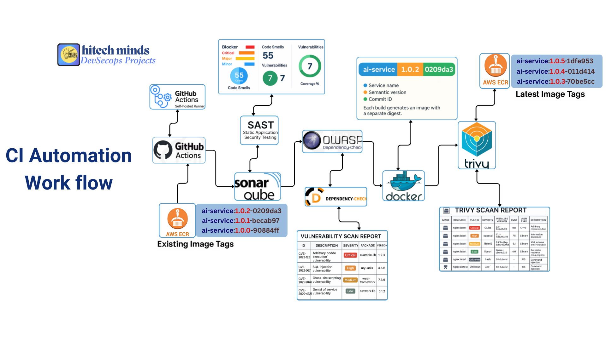
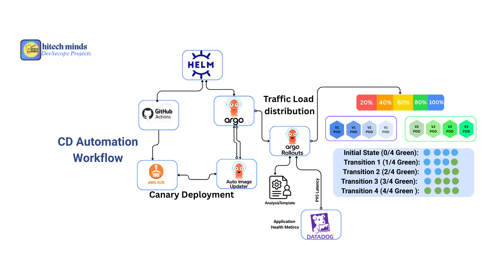
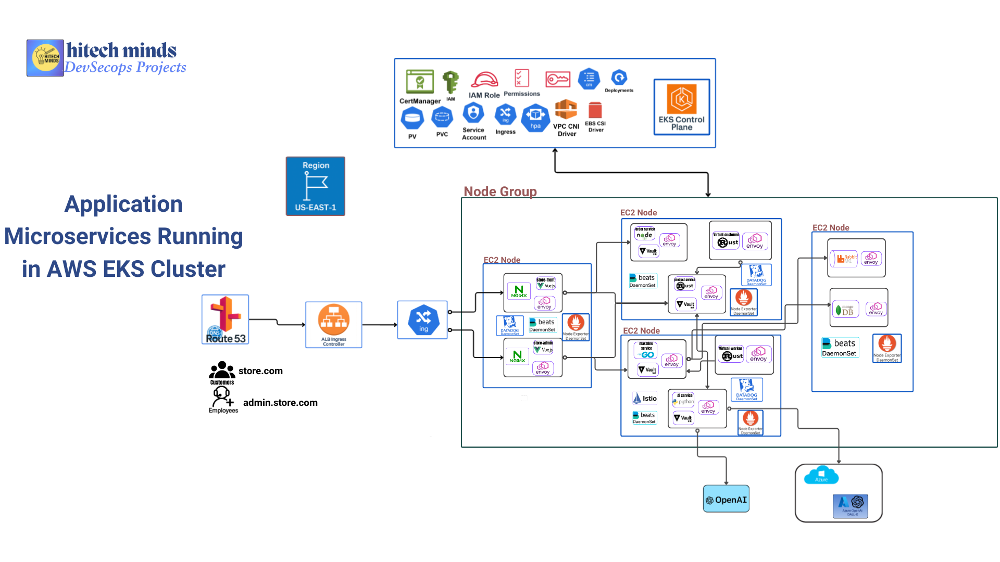
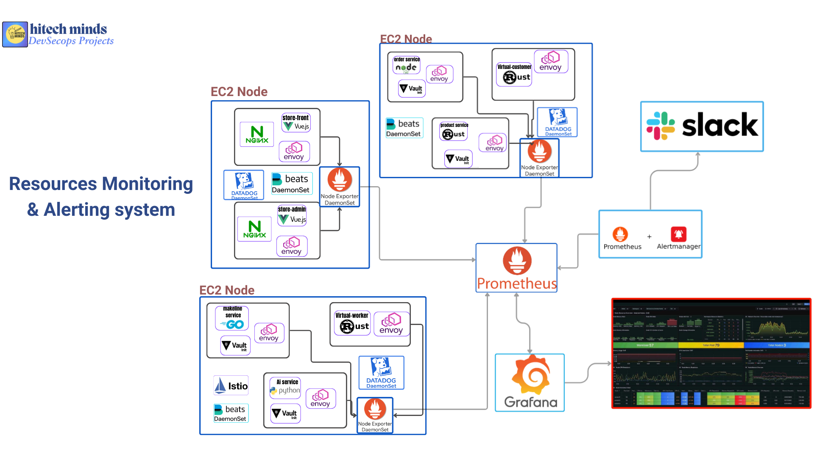
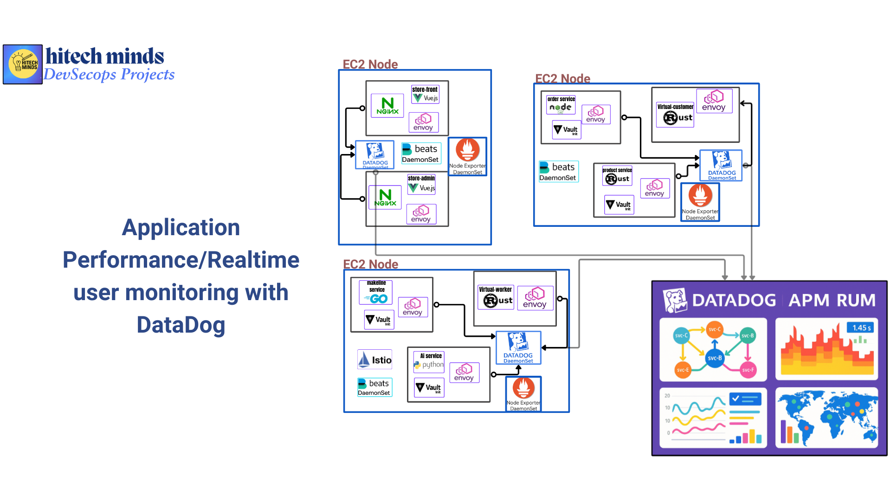
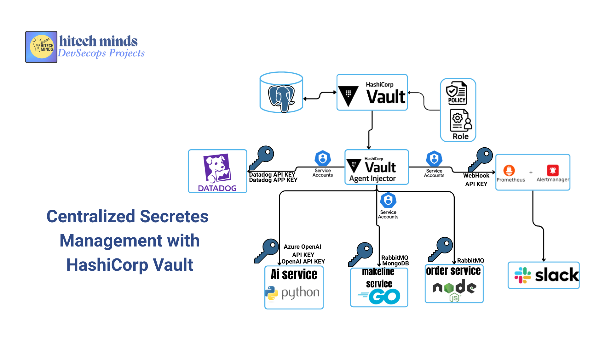
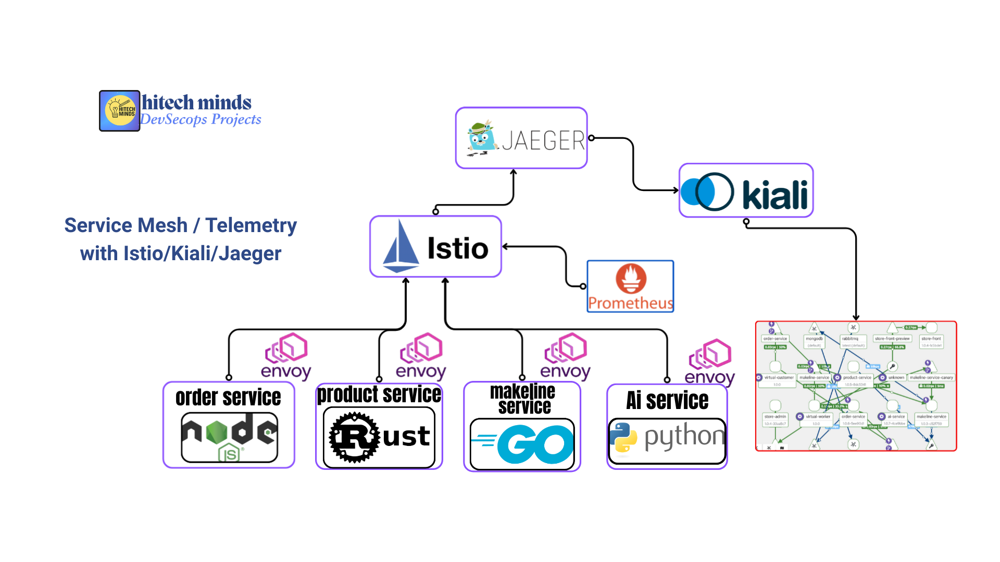

# Store Application - Production-Grade Microservices Platform

A comprehensive DevOps project demonstrating enterprise-level microservices architecture with complete CI/CD automation, advanced deployment strategies, and production-grade monitoring solutions on AWS EKS.

---

## 🎓 Complete Course Available

**Enroll in the full course**: [DevSecOps Advanced Project - Real-Time Production Application](https://www.udemy.com/course/devsecops-advanced-project-real-time-production-application/?couponCode=CM251226G1)

Learn hands-on implementation of AWS EKS, ArgoCD, Argo Rollouts, HashiCorp Vault, Istio, Datadog, Prometheus, and complete CI/CD automation.

---


## 📋 Table of Contents

- [Overview](https://github.com/prasad-moru/store-app-application?tab=readme-ov-file#-overview)
- [Architecture](https://github.com/prasad-moru/store-app-application?tab=readme-ov-file#-overview)
- [Technology Stack](https://github.com/prasad-moru/store-app-application?tab=readme-ov-file#-overview)
- [Microservices](https://github.com/prasad-moru/store-app-application?tab=readme-ov-file#-overview)
- [Quick Start](https://github.com/prasad-moru/store-app-application?tab=readme-ov-file#-overview)
- [Project Structure](https://github.com/prasad-moru/store-app-application?tab=readme-ov-file#-overview)

---

## 🎯 Overview

This project implements a complete e-commerce platform using microservices architecture, deployed on AWS EKS with production-grade DevOps practices.

**Key Features**:
- Infrastructure as Code with Terraform
- GitOps with ArgoCD and Argo Rollouts
- Canary & Blue-Green deployments
- Comprehensive monitoring (Datadog, Prometheus, Grafana)
- Centralized secret management with HashiCorp Vault
- Service Mesh with Istio
- Automated CI/CD with GitHub Actions

---

## 🏗️ Architecture

### Application Architecture


8 microservices handling e-commerce operations with AI-powered features, order processing, and product management.

### CI/CD Pipeline


Automated pipeline with SonarQube, OWASP, Trivy scanning, semantic versioning, and ECR deployment.

### Deployment Strategy


- **Canary**: ai-service, order-service, product-service, makeline-service
- **Blue-Green**: store-front, store-admin
- **Standard**: virtual-customer, virtual-worker

### Infrastructure


Multi-AZ EKS cluster with auto-scaling node groups, ALB ingress, EBS CSI driver, and ECR integration.

### Monitoring


Prometheus + Grafana for infrastructure metrics, Alertmanager with Slack integration.

### Application Performance Monitoring


Datadog APM for backend services and RUM for frontend applications.

### Logging


ELK Stack (Elasticsearch, Logstash, Kibana, Filebeat) for centralized logging.

### Secrets Management


HashiCorp Vault with PostgreSQL backend and Vault Agent Injector for runtime secret injection.

### Service Mesh


Istio service mesh with Jaeger tracing and Kiali visualization.

---

## 🛠️ Technology Stack

**Infrastructure**: AWS EKS, Terraform, VPC, ALB, EBS, ECR  
**Kubernetes**: v1.31, Helm, kubectl  
**CI/CD**: GitHub Actions, ArgoCD, Argo Rollouts, ArgoCD Image Updater  
**Security**: HashiCorp Vault, Vault Agent Injector, SonarQube, OWASP, Trivy  
**Monitoring**: Datadog (APM/RUM), Prometheus, Grafana, Alertmanager  
**Logging**: Elasticsearch, Logstash, Kibana, Filebeat  
**Service Mesh**: Istio, Envoy, Jaeger, Kiali  
**Databases**: PostgreSQL, MongoDB, RabbitMQ  

---

## 🎯 Microservices

| Service | Language | Purpose |
|---------|----------|---------|
| **store-front** | Vue.js | Customer web interface |
| **store-admin** | Vue.js | Employee management interface |
| **order-service** | Node.js | Order placement and management |
| **product-service** | Rust | Product CRUD operations |
| **makeline-service** | Go | Order processing from queue |
| **ai-service** | Python | AI text/image generation |
| **virtual-customer** | Rust | Order creation simulator |
| **virtual-worker** | Rust | Order completion simulator |

---

## 🚀 Quick Start

### Prerequisites
- AWS Account with EKS access
- kubectl, Terraform, Helm, Docker, AWS CLI

### Deploy Infrastructure
```bash
# Clone repository
git clone https://github.com/prasad-moru/GenAiStoreApp.git
cd GenAiStoreApp/aws_eks_infrastructure/Env/Dev

# Deploy with Terraform
terraform init && terraform apply

# Configure kubectl
aws eks update-kubeconfig --name dev-eks-dev-cluster --region us-east-1
```

### Install Platform Services
```bash
# Create namespaces
kubectl create namespace platform
kubectl create namespace monitoring
kubectl create namespace datadog
kubectl create namespace argocd
kubectl create namespace application

# Install Vault
helm install vault ./vault -f ./vault/vault-values.yaml -n platform

# Install PostgreSQL
helm install postgresql ./postgresql -n platform -f ./postgresql/values.yaml

# Install Prometheus & Grafana
helm install prometheus ./prometheus -n monitoring -f ./prometheus/values.yaml
helm install grafana ./grafana -n monitoring -f ./grafana/values.yaml

# Install Datadog
helm install datadog ./datadog -n datadog -f ./datadog/datadog-values.yaml

# Install Istio
helm repo add istio https://istio-release.storage.googleapis.com/charts
helm install istio-base istio/base -n istio-system
helm install istiod istio/istiod -n istio-system

# Install ArgoCD & Argo Rollouts
helm install argo-cd ./argo-cd -f ./argo-cd/values.yaml -n argocd
helm install argo-rollouts ./argo-rollouts -f ./argo-rollouts/values.yaml -n argocd
helm install argocd-image-updater ./argocd-image-updater -f ./argocd-image-updater/values.yaml -n argocd
```

### Deploy Applications
```bash
# Enable Istio injection
kubectl label namespace application istio-injection=enabled

# Deploy via ArgoCD
kubectl apply -f infrastructure/argocd/applications/
```

## 📁 Project Structure

```
GenAiStoreApp/
├── application_services/          # Microservice source code
├── aws_eks_infrastructure/        # Terraform IaC
│   ├── Env/Dev/Stg/Prod/
│   └── modules/
├── helm-charts/                   # Application Helm charts
├── infrastructure/                # Platform services (ArgoCD, Prometheus, etc.)
├── .github/workflows/             # CI/CD pipelines
├── monitoring/                    # Monitoring configurations
├── logging/                       # ELK stack configurations
├── architecture-diagrams/         # Architecture diagrams
└── store_app_docs/               # Additional documentation
```

---

## 📊 Key Achievements

- ✅ **8 Microservices** with automated CI/CD
- ✅ **Multi-AZ Deployment** with 99.99% availability
- ✅ **Canary Deployments** with 95%+ automatic promotion
- ✅ **Zero Downtime** deployments
- ✅ **100% Observability** coverage
- ✅ **Centralized Secret Management** with Vault
- ✅ **7-Day Log Retention** in Elasticsearch

---

## 👥 Author

**Prasad Moru**  
GitHub: [@prasad-moru](https://github.com/prasad-moru)  
Email: prasadmoru@gmail.com

---

**Last Updated**: December 2025 | **Version**: 1.0.0
